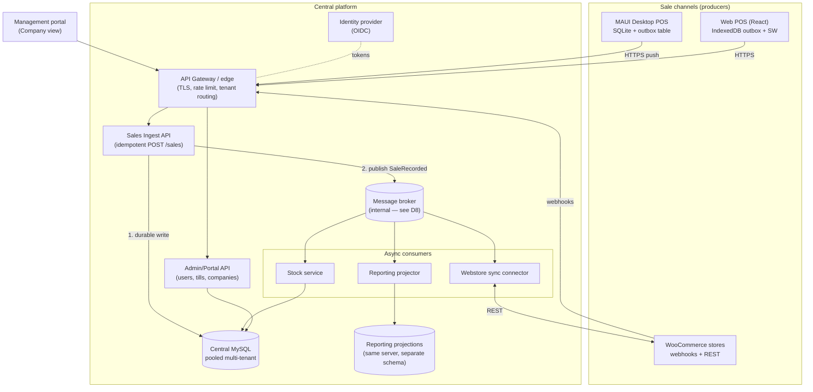

# Plutus Platform Architecture

**Status:** v3 (cleaned) · 2026-07-23
**Scope:** Multi-tenant central platform for MAUI desktop tills, the React web POS, a company-management portal, stock management, payments/cash, and webstore (WooCommerce) integration.
**Hosting stance:** Cloud-agnostic — every component maps to both an Azure service and a self-hosted equivalent (§13).
**Companion documents:** `archive/kapow-db-gap-analysis.md` (database review), `plutus-implementation-plan.md` (execution plan).

---

## 1. The key question, answered

**The web POS writes directly to the central database via the API. There is no separate server-side database that syncs.**

- The webapp *already has* its sync layer: the IndexedDB checkout outbox + service worker. That is the client-side equivalent of the desktop till's local DB + queue. A second server-side "staging" DB would duplicate that mechanism, add a consistency boundary, and delay stock/reporting visibility for no benefit.
- The correct mental model: **every channel is a producer of immutable sale events into one idempotent ingest endpoint.** The MAUI till buffers in SQLite and pushes; the webapp buffers in IndexedDB and pushes; a webstore order arrives via webhook. Same endpoint, same contract, same dedupe rules. The only difference between channels is how long their local buffer typically holds events (webapp: seconds; till: seconds to days if offline).
- What makes this safe is not *where* the write lands but that the write is **idempotent and client-identified** (§4.2). Once that's true, "direct write" and "sync" are the same operation with different latencies.

One rule the web POS must respect: **checkout never blocks on anything but the ingest ACK.** Stock decrement, reporting rollup, and webstore sync all happen asynchronously behind the API.

---

## 2. System overview



Key principle: **write-then-publish.** The ingest API durably writes the sale to MySQL (with a transactional outbox row), returns the ACK, and a relay publishes `SaleRecorded` to the broker. Consumers (stock, reporting, webstore sync) are downstream and can lag or fail without ever losing a sale.

---

## 3. Multi-tenancy

For SaaS scale, use the **pooled model: shared database, shared schema, `TenantId` on every row** — with an escape hatch to move large tenants to dedicated databases later.

| Concern | Design |
|---|---|
| Isolation | `TenantId` (GUID) column on every tenant-owned table; EF Core **global query filters** enforce it on every query; composite indexes lead with `TenantId` |
| Tenant resolution | From the JWT (`tid` claim) at the gateway — never from a request body or URL parameter |
| Tenant catalogue | A small `Tenants` control table: id, name, status, plan, entitlements, **connection-string pointer**. Day one every tenant points at the pooled DB; a hot tenant can be migrated to its own DB with zero code change |
| Provisioning | `POST /tenants` in the Admin API: creates tenant row, first admin user, default company/store/till records. Automated from day one |
| Data protection | Per-tenant encryption keys only if a client contract demands it; don't pay that complexity up front |

Why not schema-per-tenant or DB-per-tenant as default: at hundreds of tenants, migrations, connection pooling, and backup management become the dominant operational cost. Pooled + query filters + the pointer escape hatch is the standard SaaS trajectory.

---

## 4. Sale ingestion — the one pipeline

### 4.1 The contract (all channels)

```
POST /api/v1/sales
Authorization: Bearer <token carrying tenant + device identity>
Idempotency-Key: <SaleId>

{
  "saleId":      "018f3c1e-...",   // UUIDv7, generated at the till/browser
  "deviceId":    "d-7f2a...",      // unique per till / web-POS device
  "deviceSeq":   4182,             // monotonic per device
  "businessDay": "2026-07-23",
  "occurredAt":  "2026-07-23T14:31:07Z",  // device clock
  "lines":  [ { "itemId": "...", "qty": 2, "unitPricePence": 499,
                "vatRate": 20.0, "vatAmountPence": 166,
                "overriddenFromPence": null, "discounts": [...] } ],
  "tenders":[ { "type": "CARD", "amountPence": 998, "providerRef": "..." } ],
  "totals": { "grossPence": 998, "vatPence": 166 }
}
```

Rules:

- **Idempotent insert:** on duplicate `(TenantId, SaleId)` return `200` with the original result, not an error. This single rule makes retry-forever safe for every channel.
- **Money is integer pence end-to-end** — `BIGINT` pence at rest, no decimal maths in flight (the webapp's existing convention, extended everywhere).
- **VAT is captured on the line at time of sale** (rate + amount) — never derived by joining a mutable rates table (see gap analysis F2).
- **Never `PUT`/`UPDATE` a sale.** Corrections are new events (refund, void) referencing the original `saleId` — audit trail for free, trivial consumers.
- **VAT integrity** validation runs at ingest; failures land in a quarantine table for review rather than being rejected back to an offline till that can't fix them.

### 4.2 Identity of a transaction

Global uniqueness = `TenantId + SaleId`, where `SaleId` is a **UUIDv7 minted at the point of sale**. Keep `deviceId` and `deviceSeq` alongside:

- `deviceId` → attribution, per-till reporting, device credential revocation
- `deviceSeq` → **gap detection**: if the server has seq 4181 and 4183 from a till, it knows 4182 is still on that till and can flag it
- Human-friendly receipt numbers are display formatting (`{tillCode}-{deviceSeq}`), never the primary key

### 4.3 Channels

| Channel | Local buffer | Transport |
|---|---|---|
| MAUI till | SQLite; sale committed locally in one transaction with an outbox row | Background pusher: HTTPS POST, exponential backoff, drains in `deviceSeq` order |
| Web POS | Existing IndexedDB checkout outbox + service worker | Same endpoint; SW retry loop |
| WooCommerce | none (store is remote) | Webhook → connector translates order → same `POST /sales` internally, `channel: "WEB_STORE"` |

### 4.4 Where the queue lives

The queue sits **server-side, not on the wire.** Exposing a broker (AMQP) to hundreds of retail-site networks means broker credentials on every till and firewall fights. Instead:

- The **local outbox table is the till's queue** (durable, ordered, survives crashes).
- The wire is plain **HTTPS to the idempotent ingest API** — works through any shop firewall, terminates at the existing gateway.
- The **broker is internal**, fed by the ingest API's transactional outbox, fanning out to consumers. Per D8, start broker-less (MySQL outbox + polling consumers with per-consumer cursors, ~200 lines of owned code); adopt RabbitMQ/Service Bus only when volume demands — consumers depend only on "events arrive", so the swap is plumbing, not redesign.

All message-queue guarantees hold (durability, retry, per-device ordering, at-least-once + dedupe = effectively-once) with no exposed-broker burden.

---

## 5. Data model (core entities)

```
Tenant ─┬─ Company ─┬─ Store ─┬─ Till (deviceId, credentials, lastSeenSeq)
        │           │         └─ StockLocation (type STORE — tills share it by default)
        │           ├─ Warehouse → StockLocation (type WAREHOUSE, no tills)
        │           └─ (rollup target for "Company view")
        ├─ User ─ RoleAssignment (role @ scope: company/store/till, optional time window)
        ├─ Role ─ Permission (portal + POS permissions — one catalogue, §7.2)
        ├─ Item ─ Barcodes (many per item) / ItemParameters (catalogue — master here)
        ├─ PriceList / PriceOverride / PricePolicy (global | override | local — §7.4)
        ├─ Sale ─ SaleLine ─ SaleTender   (immutable, append-only)
        ├─ SaleAdjustment (refund/void, references Sale)
        ├─ CashSession (float, paid-in/out, X/Z, variance — §9.2)
        ├─ StockLocation ─ StockMovement (append-only ledger; typed: RECEIPT |
        │                │   TRANSFER_OUT/IN | SALE | RETURN | ADJUSTMENT | WRITE_OFF)
        │                └─ StockLevel   (materialised current qty)
        ├─ Supplier ─ PurchaseOrder ─ POLine (goods-in feeds RECEIPT movements — §9.4)
        ├─ Customer ─ CreditAccount ─ CreditEntry (store credit ledger — §9.3)
        │           └─ Membership (club/loyalty)
        ├─ FinancialPeriod (period close/lock, yearly statements — §7.1)
        └─ WebstoreConnection (Woo URL, keys, mapping, sync cursor)
```

- **Store grouping (D10):** a `Store` layer sits between Company and Till — stock is held per store (not per till), RBAC/pricing/reporting/Woo connections all scope to it. Single-location clients get an auto-created default Store at provisioning; no special cases. Till-level stock remains possible (StockLocation is a separate entity).
- **Sales are append-only; stock is a movement ledger.** Current stock = materialised sum, rebuildable from the ledger — what makes multi-channel stock reconcilable when things go wrong.
- **Reporting is a projection:** the reporting consumer folds `SaleRecorded` events into pre-aggregated rollup tables (per till/store/company/day). Dashboards read those; the ingest path stays fast; reports are rebuildable after a bug.
- Catalogue master lives centrally; tills and the webapp cache it; WooCommerce receives pushed updates.

---

## 6. Services & application boundaries

### 6.1 Modular monolith

One ASP.NET Core solution, strict internal module boundaries, one deployable — split into separate services only when scale forces it:

| Module | Owns | Grows out of |
|---|---|---|
| `Plutus.Identity` | OIDC, users, roles, device credentials | `TestTokenAuth` (§11) |
| `Plutus.Tenancy` | tenants, companies, stores, tills, provisioning | new |
| `Plutus.Sales` | ingest API, sale store, VAT integrity, outbox relay | existing `Sale/*` endpoints |
| `Plutus.Catalogue` | items, barcodes, band validation, publish feed | `ItemParameters.Search` + guardrail |
| `Plutus.Pricing` | price lists, overrides, policies | new |
| `Plutus.Stock` | movement ledger, levels, transfers, goods-in | new |
| `Plutus.Cash` | cash sessions, X/Z, banking reconciliation, compliance monitors | new |
| `Plutus.Customers` | customers, store credit, memberships | new |
| `Plutus.Integrations` | WooCommerce connector — **sellable add-on** (§8.1) | new |
| `Plutus.Payments` | payment-provider adapters — **sellable add-on** (§9.1) | new |
| `Plutus.Reporting` | projections, Company-view rollups, financial periods | `Sale/Summary` |
| `Plutus.Fleet` | heartbeat, device status, version management | new |

Platform note: **.NET 7 is out of support** — the backend moves to **.NET 8 LTS** as the first work package; Pomelo/EF Core carry across.

### 6.2 Frontend/backend isolation — hard rule (D20)

**The backend is fully isolated from both frontends. The only communication is versioned HTTPS APIs.**

- Frontends (web POS, management portal) are **static SPAs** — built files served by the edge (Caddy/CDN). No server-side rendering, no shared session state, no backend templates, nothing of the backend deployed with them.
- Frontends never touch the database, the broker, or any internal service — **only `/api/v1/*`** with a Bearer token. Same rule for the MAUI till and third parties: everyone is an API client, no privileged paths.
- The API is **contract-first**: OpenAPI spec is the source of truth; frontend TypeScript types are generated from it (generation is dev-time only — no runtime dependency, consistent with the minimal-dependency discipline).
- CORS locked to the known frontend origins; API and static assets can be deployed, scaled, and rolled back independently.
- Practical consequence: the webapp, the portal, the MAUI till, and the Woo connector all exercise the *same* public surface — there is no "internal" API for the backend's own frontends to drift into.

The **management portal** is a second React app (same minimal-dependency discipline), separate from the POS webapp — different users, different auth policies, different release cadence. Its functional design is §7.

**Deployment subdomains (decided 2026-07-23, DNS-verified on the `*.huggett.dscloud.me` wildcard):**

| Host | Serves | Status |
|---|---|---|
| `plutus.huggett.dscloud.me` | Web POS / till (static SPA) | live |
| `admin.plutus.huggett.dscloud.me` | Management portal (static SPA) | Phase 3 |
| `api.plutus.huggett.dscloud.me` | Backend API — the single isolated surface all clients call | Phase 3 cutover |

Both SPAs call `api.` with a Bearer token; CORS is locked to the two frontend origins; each host deploys and rolls back independently (D20). Until the portal lands, the till keeps reaching the API via the `/api` reverse-proxy on its own host.

---

## 7. Management portal (back office)

The portal is where a client's head office lives. Everything below reads projections or the transactional store through the Admin/Reporting APIs — nothing touches the ingest path.

### 7.1 Financials — rollup to drill-down

One navigation spine: **Company → Store → Till → business day → individual transaction.**

- **Rollup views:** revenue, transaction count, average basket, VAT by rate — per day/week/month/year, at any level of the spine. Served from pre-aggregated projection tables, fast regardless of volume.
- **Transaction level:** the immutable sale record — lines, tenders, per-line VAT, device, operator, linked refunds/voids.
- **VAT:** per-rate summaries per period, shaped to feed UK VAT return boxes; quarantined anomalies surface here for review.
- **Yearly financial statements:** `FinancialPeriod` with an explicit **period close** — closing snapshots the rollups and locks the period; late-arriving events post into the next open period, so a published year never silently changes. CSV/PDF exports.
- **Boundary (D11):** Plutus produces sales and VAT reporting with period discipline — it is not a double-entry accounting package. Clean exports (later a Xero/QuickBooks connector — another sellable add-on).

### 7.2 RBAC — one model, portal to till

1. **Permission** — fixed, code-defined catalogue. Portal permissions (`portal.financials.view`, `portal.users.manage`, `portal.stock.adjust`, `portal.prices.manage`, `portal.tills.enrol`, …) and POS permissions (`pos.sell`, `pos.refund`, `pos.void`, `pos.discount.max:{n}`, `pos.price-override`, `pos.no-sale`, `pos.reports.view`, …) in **one catalogue** — one admin surface.
2. **Role** — a named permission bundle. Built-ins (Owner, Company Admin, Store Manager, Supervisor, Cashier, Auditor) plus tenant-defined.
3. **RoleAssignment** — `User × Role × Scope (+ optional time window)`. Scope = company, store, or individual till.

Resolution: effective permissions at a resource = union of assignments at that node or above. **Which POS a user can access falls out of scoping** — no assignment covering a till, no login there.

- **Time windows:** assignments can carry days/hours (e.g. Sat staff 09:00–17:30) — enforced at token issue *and* by the till locally.
- **Offline enforcement:** the till downloads each user's effective POS permission set with the catalogue sync and enforces locally — refunds, discount ceilings, overrides keep working without internet. Changes propagate on next sync; revocation also kills the central token.
- **Auditing:** every permission-gated POS action records operator + permission in the sale/adjustment event — "who authorised this refund?" is answered from the transaction drill-down.

### 7.3 Stock views

- **Central view:** on-hand per item summed across all locations, per-location breakdown one click in.
- **Per-store view:** the store's own location(s) — tills share the store's stock by default (D10); genuine per-till stock possible.
- **Warehouses:** `StockLocation`s of type `WAREHOUSE` with no tills — added freely in the portal.
- **Transfers:** warehouse→store (or store→store) as paired movements with an in-transit state — never double-counted.
- **Stock takes / adjustments:** counted-vs-expected with reason codes, posting adjustment movements — never editing levels directly.

### 7.4 Pricing — global, override, or local

A **price policy**, per item (or per category with item exceptions), controls who owns the price:

| Policy | Behaviour |
|---|---|
| `CENTRAL` | HQ sets the price; stores/tills read-only |
| `CENTRAL_WITH_OVERRIDE` | HQ price is the default; a store may set an override that survives HQ changes (HQ can force-reset) |
| `LOCAL` | The store owns the price; HQ sees but doesn't set |

Effective price at a till = store override (if policy permits) → else company price list. Entries are **effective-dated** (schedule Sunday-night repricing); tills pick changes up via catalogue sync. Every change audited (who, when, old→new, scope). Portal: global price editor with bulk ops, per-store override view with variance report, policy manager.

*(Distinct from `pos.price-override` — the transaction-time, permission-gated override of one sale's price, also audited.)*

### 7.5 Adding a POS

Create a Till under a Store → portal issues a one-time enrolment code → the new till (MAUI or web) redeems it → receives device credential + `deviceId` → syncs catalogue/prices/permissions → appears on the fleet dashboard (§10.2). Decommissioning revokes the credential; historical sales remain.

---

## 8. Webstore integration

### 8.1 Connectors are a sellable add-on product (D9)

The WooCommerce connector (and every future webstore connector) is **built by us and packaged as a separate, chargeable plugin** — not baked into core:

- **Entitlement-gated:** the tenant record carries entitlements (e.g. `woo-connector`); the Integrations module activates only for licensed tenants. Portal shows it as an upgradeable add-on.
- **Hard module boundary:** the connector uses *only* the public event stream (`SaleRecorded`, `StockLevelChanged`, `ItemUpdated`) and the standard `POST /sales` API — the same surfaces a third party would use. Independently versioned, priceable, deployable; proves the integration surface for connector #2 (Shopify etc.).
- **Billing unit:** one `WebstoreConnection` = one billable store connection.
- Any WordPress-side component is a thin, GPL-compatible WP plugin; the valuable logic stays server-side in Plutus.

### 8.2 Connector behaviour (per tenant, per store)

- **Inbound orders:** Woo webhook (`order.created`) → HMAC validated → translated to the standard sale event → `POST /sales` → stock/reporting flow as normal. A reconciliation poll (REST, sync cursor) catches missed webhooks — Woo webhooks are not guaranteed delivery.
- **Outbound stock/price:** subscribes to `StockLevelChanged` / `ItemUpdated`, pushes via Woo REST (batch endpoint, rate-limited). **Debounced** — push the latest level at most every N seconds, not every movement.
- **Oversell policy** per tenant: safety-buffer quantity, or "web stock = on-hand − reserved". Promise convergence + buffer, not real-time accuracy.

---

## 9. Payments, cash, customers, suppliers

### 9.1 Card payment integration

- **`PaymentProvider` adapter** in the till/web POS (authorise → result → tender carries provider ref); providers (Dojo, Stripe Terminal, SumUp, Adyen, Zettle) are adapters chosen per tenant/store — evaluate on UK card-present rates, MAUI/Windows SDK quality, Pay-by-Link for the web POS. Sellable-add-on pattern applies.
- **The failure mode that matters:** payment approved but sale not recorded (or vice versa). Rule (D13): the terminal ref is written into the pending sale *before* capture is confirmed; an unresolved-payments queue surfaces mismatches.
- **Reconciliation:** daily provider settlement vs recorded card tenders, per store — automatic, exceptions in the portal (feeds 9.2).
- **Commercial note:** payments margin is often a POS SaaS's largest revenue line — factor into provider choice.

### 9.2 Cash management & day-end

- **Cash session per till per business day:** opening float → paid-ins/outs (reasons, permission-gated) → closing count → variance — all as events through the same ingest pipeline (D14), so it works offline.
- **X report** (non-closing snapshot) and **Z report** (closes the session; one per business day, till-enforced) — generated locally, synced like sales.
- **Portal banking view:** per store/day — expected cash vs counted vs banked, card tenders vs provider settlement, variances flagged.
- **Overdue cash-up monitor (configurable):** a till with sales but no Z/cash-up for *N* days is flagged. Thresholds **per tenant, overridable per store** — defaults warn 3 / escalate 7 / critical 14 days — each level choosing outputs (dashboard badge, daily digest, immediate alert). Counted in **trading days** (store opening-hours config, §10.2), so a shop closed Sundays isn't nagged. First rule of a generic **compliance-monitor** framework (D19) — later checks ("no stock take in 6 months", "variance over £X three days running", "offline during trading hours") are config rows, not code.

### 9.3 Customers, store credit, loyalty

The Kapow data shows informal versions of all three (`Credit` tender, `Club` pseudo-item). Formalised:

- **Customer** — optional on a sale; central, synced to tills like catalogue data.
- **Store credit is a liability ledger (D15):** `CreditAccount` + append-only `CreditEntry` (issue, redeem, expire) — never a mutable balance. Redemption is a tender type; issuance from refund-to-credit or permission-gated grant. Outstanding credit is a period-close figure (§7.1).
- **Membership/loyalty:** proper entity with renewal dates; benefits express as auto-applied discounts through the existing promotion tables. Credit and membership redeemable at till and webstore alike.

### 9.4 Suppliers, purchase orders, goods-in

The −28,508 stock counter (gap analysis F5) is stock management without receiving. Phased after the ledger:

- `Supplier`, `PurchaseOrder`, `POLine` (ordered/received qty, cost).
- **Receiving** posts typed `RECEIPT` movements; partial deliveries supported; cost at receipt feeds margin reporting later.
- Movement types are fixed now (§5) so ledger consumers never rework.
- Scope stays honest: PO → receive → ledger. Forecasting/reordering is a later, separately-priceable module.

---

## 10. Platform operations

### 10.1 Billing, tenant lifecycle, offboarding

- **Subscription model:** base fee + per-till + add-ons (Woo, payments, future modules) — all expressed through tenant **entitlements** (§8.1); billing (Stripe Billing or similar) just writes entitlements.
- **Lifecycle:** trial → active → past-due (grace, warnings) → suspended (**portal locks, tills keep trading and syncing** — never brick a shop over an invoice, D16) → closed.
- **Offboarding (GDPR + contract exit):** self-service full data export (sales, stock, customers as CSV/JSON) and scheduled deletion with certificate — designed now, not retrofitted under a deadline.
- **Retention policy** per data class: sales 6+ years (HMRC); heartbeat telemetry weeks.

### 10.2 Fleet operations & till heartbeat

Every till (MAUI and web-POS devices alike) sends a lightweight ping every 60 s:

```
POST /api/v1/heartbeat
{ "deviceId": "...", "appVersion": "2.3.1", "outboxDepth": 3,
  "oldestUnsyncedAge": 42, "deviceClock": "2026-07-23T14:31:07Z" }
```

- Server keeps `LastSeenAt` + latest payload in a **fast store** (Redis / in-memory with periodic persist — high-write, low-value data; don't pound MySQL, D17). Status: **ONLINE** (< 2 min), **STALE** (2–5 min), **OFFLINE** (> 5 min).
- **Online ≠ healthy:** a till can be reachable with a stuck outbox. The dashboard shows both dimensions — connectivity (heartbeat) and **sync health** (outboxDepth / oldest-unsynced, cross-checked against server-side `deviceSeq` gap detection §4.2). A green till with a rising backlog is a red till.
- **Fleet dashboard:** company → store → till: status, last seen, app version, unsynced count, clock skew. Company view rolls up ("3 of 41 tills offline").
- **Alerting:** offline or backlog past threshold **during the store's trading hours** → email/webhook. Store opening hours are a small config entity (shared with §9.2's monitor).
- **Piggyback channel:** heartbeat *responses* carry pull signals — "catalogue version n available", "config changed", "sync now", "remote-lock this device" — near-real-time control with no inbound path to tills.
- **Software management:** tills report `appVersion`; staged rollouts (one store → cohort → all); server minimum-version gate (`426 Upgrade Required` past a deadline); **versioned API** (`/api/v1/…`) so weeks-stale offline tills resync safely mid-rollout (D18).

### 10.3 Stated assumptions

- **GBP / UK VAT only** for the current horizon; currency lives on the tender-and-price layer if that changes.
- **Receipts:** ESC/POS printing is a MAUI/hardware concern; email receipt is a platform service (needs §9.3's customer entity). Receipts are reproducible from the immutable sale record — no separate receipt store.
- **DR targets:** RPO ≤ 5 min (binlog / point-in-time restore), RTO ≤ 4 h, restore drill performed quarterly. Tills trading offline (§4) is what makes these targets survivable for clients.

---

## 11. Identity & auth

- **Humans (portal + web POS):** OIDC. Azure: Entra External ID (B2C's successor — B2C is closed to new tenants). Self-hosted: Keycloak or OpenIddict. The current `TestTokenAuth` is flag-gated — keep that flag as the seam; code against standard JWT validation so the IdP is swappable.
- **Tills (devices):** OAuth2 client-credentials per device, issued at enrolment (§7.5); tokens carry `tid` + `deviceId`. Revoking one till never touches another. The existing PBKDF2 verify becomes the enrolment/secret store.
- **Web POS:** move the token from `localStorage` toward short-lived access token in memory + refresh cookie at the IdP swap; fine as-is until then.

---

## 12. Failure modes designed for

| Failure | Handling |
|---|---|
| Till offline for days | Outbox drains on reconnect in seq order; gap detection flags stragglers; `businessDay` keeps reporting honest despite late arrival |
| Duplicate push (lost ACK, retry) | Idempotent insert on `(TenantId, SaleId)` — the cornerstone rule |
| Device clock wrong | Server records `receivedAt` alongside device `occurredAt`; reporting uses `businessDay`; skew flagged via heartbeat |
| Broker/consumers down | Sales still ACK (write-then-publish); stock/reports lag; sales never lost |
| Payment captured, sale not recorded | Terminal ref written before capture confirm; unresolved-payments queue (§9.1) |
| Woo webhook missed | Reconciliation poll with sync cursor |
| Two channels sell the last item | Ledger goes negative, alert raised, per-tenant oversell policy — never block a face-to-face sale on stock |
| Tenant data leak | Query filters + `tid`-from-token only + composite keys + tests asserting cross-tenant queries return nothing |

---

## 12b. WP-SL — remote lock of a lost or stolen till · **≈1½–2d** · ⚠⚠ THE KILL SWITCH IS HALF-BUILT

> **Matt, 2026-08-21**, on whether the open decisions should become work packages: *"Make it a platform
> work package."* **Moved here from `MAUI-retrofit.md` deliberately** — it is ⬜ on the **web till and
> MAUI both**, so it was never MAUI catch-up, and sitting in a MAUI parity document is why nobody
> picked it up for twelve days.

### ⚠⚠ Why this is worse than an absent feature

`Device.Locked` and `LockReason` ship (WP5's `AddDeviceSyncSignals`), `HeartbeatResult` carries them,
and `SyncClient` surfaces `HeartbeatOutcome.Locked`. **The pieces look like a solution and are not
one:**

- **Nothing sets the flag.** No endpoint, no portal control — `grep` for `Locked =` returns nothing
  outside the migration.
- **Nothing enforces it.** `IssueDeviceTokenAsync` refuses a device only when `Status == Revoked`, so
  even once set, the lock is **advice to the till** — and a thief running modified software ignores
  advice. **A kill switch honoured only by the client is not a kill switch.**

⚠⚠ **TODAY'S ACTUAL INCIDENT TOOL IS `Revoked`.** Reach for that, not for this. Anyone reading the
column names and assuming there is a lock will lose the time that matters.

### The order, and it is not negotiable

⚠⚠ **ENFORCEMENT FIRST.** An endpoint that sets a flag nothing honours repeats the exact mistake this
package exists to correct — and it would do it while *looking* like the fix.

| # | Piece | ⚠ |
|---|---|---|
| 1 | **Enforce** — `IssueDeviceTokenAsync` refuses a `Locked` device as it refuses a `Revoked` one | ⚠ Its own message, not "revoked": a locked till can be unlocked and the manager needs to know which state they are in. ⚠ Device tokens are 12h HMAC bearers with **no server-side denylist**, so a lock takes effect at the next mint — say so in the portal, or somebody will believe a stolen till went dark instantly |
| 2 | **Set** — an RBAC-gated endpoint, audited | Gate on the same permission that revokes a till (`portal.tills.enrol` today). ⚠ Audited with **who and why**: `LockReason` exists precisely so the next person knows whether this was theft or a returned lease |
| 3 | **Portal control** — beside the existing device-removal one on Locations & tills | ⚠ Reuse the un-enrol/approve shape (WP6.2); a second idiom for "stop this till" is how an operator picks the wrong one under pressure |
| 4 | **The till's side** — `HeartbeatOutcome.Locked` already arrives; both tills must show the reason and stop trading | ⚠ **Both tills.** The web till's `deviceStanding.ts` is the C2 twin of `DeviceRevocation.cs` and is where this belongs — a third state, not a second mechanism |

### ⚠ The three questions the risk register deliberately left open — now answered

| Question | Ruling |
|---|---|
| **Who may lock a till?** | Whoever may revoke one (`portal.tills.enrol`). ⚠ A lock is *less* destructive than a revoke, so a stricter gate would push people toward the irreversible action in an emergency |
| **Is a lock reversible, and by whom?** | **Yes, by the same permission** — that is the whole point of it not being `Revoked`. ⚠ Reversible-by-nobody is a revoke with extra steps |
| **What does a locked till do with UNSYNCED SALES?** | ⚠⚠ **It must still drain its outbox.** Those sales are the shop's money and they are already committed locally. A lock stops *new* trading; destroying queued takings would make the safe action the expensive one, and staff would stop using it. **The outbox pushes on the DEVICE token, so piece 1 must refuse a token for SELLING without killing the drain** — that is the design constraint this package turns on, and it is why enforcement is a day rather than an hour |

*DoD:* a locked device is refused a new token with a message naming the lock; its queued sales still
reach the server; both tills show the reason and refuse to sell; unlocking restores trading without a
re-enrol; and the audit row names who locked it, when and why. ⚠ Prove the drain with a till that has
unsynced sales **before** it is locked — the interesting case is not the empty one.

⚠ **Then delete the "half-built" entry from `MAUI-retrofit.md` §9 risk 4** rather than leaving a risk
that reads as open. Its A0 and Part B rows are ⬜ on both tills and stay that way until piece 4 lands.

---
## 12c. The 2026-08-21 backlog — eighteen items, nine work packages

> **Matt, 2026-08-21**, in one message, spanning the portal, reporting, tenancy, a public site, the
> ticket desk and the till. Registered here rather than half-started: several are a day or more each,
> and the four that were minutes were done the same afternoon (see **Already done** below).

⚠ **The ordering below is by DEPENDENCY, not by size.** WP-FY has to land before the VAT report can be
made to match anything, and WP-DRILL is worthless while the reports still lie about which days exist.

### Already done, 2026-08-21 — do not raise these again

| Asked | What it was | Where |
|---|---|---|
| *"How do I turn off the 'Test' on the webtill?"* | ⚠⚠ **You could not.** The literal string `test` in `App.tsx`, so the badge that says *"this is not the real till"* would have shipped **onto the real till**. Now `VITE_ENV_BADGE`: any text shows it, **unset shows nothing**, and unset is the default — a forgotten environment must fail towards no badge. | `App.tsx`, `vite-env.d.ts`, `.env.example` |
| *"a health dashboard … which I believe exists, but I can't get to it"* | It does: **Platform → Health** — error rate, p95, consumer lag, quarantine, alerts. Eleven peer tabs were crammed into the toolbar beside the `Platform` heading, so on a narrow window they wrapped behind the title and on a wide one they read as decoration. Now their own `nav.tabs` row. | `PlatformPage.tsx`, `portal.css` |
| *"Can the discount settings box be white like the others"* | `.card` had a border and **no background**, so the page's grey showed through beside `.panel`, which sets one. | `portal.css` |
| *"Also Prices, can it be collapsed like discount settings"* | ⚠ `open` by default, unlike Discount Settings — this is the Prices page, and a page whose main content is shut on arrival reads as broken. | `PricesPage.tsx` |

### WP-FY — the company year and the VAT periods, set in the portal · **≈1½d** -> **DONE 2026-08-21**

> *"I need to be able to set the company year in the portal. And the VAT periods. This then needs to
> be reflected in the reports, specifically the VAT reports needs to match the months it reports on."*

⚠⚠ **THE PERIODS ARE QUERY PARAMETERS WITH DEFAULTS, NOT SETTINGS.** `ReportsController.VatCorrections`
takes `basis = "quarter"` and `staggerEndMonth = 3` off the query string, and `VatPeriodOf` buckets on
them. So the shop's actual stagger is **whatever the caller last typed**, and every screen that omits
them silently gets stagger 1 — right for most retailers, wrong for the ones it is wrong for, with
nothing on screen admitting which.

| # | Piece | ⚠ |
|---|---|---|
| 1 | **Store it** — financial-year start, VAT basis (quarter/month), stagger group, on the tenant | ⚠ **Not per store.** A VAT return is filed by the business, and a per-store setting would invite two stores to disagree about one return. |
| 2 | **Portal control** — Company page, beside the other business facts | ⚠ Changing a stagger **re-buckets history**. Say so before saving, and record who changed it: this moves numbers on a filed return. |
| 3 | **The report reads it** — the query parameters become an override, not the source | ⚠ Keep the parameters: `vat-corrections` is also how you *test* a different basis. What changes is that the default stops being a constant. |
| 4 | **The report says which basis it used**, on screen | ⚠⚠ A VAT report that does not name its period basis cannot be checked against a filed return, which is the only thing it is for. |

**Done when** a stagger-2 business sets it once in the portal and every VAT screen buckets
Jan/Apr/Jul/Oct without anyone passing a parameter — and the report says so in words.

### WP-ZERO — a day with no sales is a zero, not a gap · **≈½d** · ⚠ DO THIS FIRST -> **DONE 2026-08-21**

> *"The reports still have to show ALL days, even ones where no sales were made e.g. this graph jumps
> from the 15th to the 17th."*

⚠⚠ **THE SAME CLASS OF FAULT AS THE 2026-08-21 TIMESTAMP BUG: the client renders what the server
returned and assumes that is what exists.** A day with no takings has no row, so the chart draws the
next bar adjacent and the axis silently lies about the interval — 15 Aug beside 17 Aug reads as two
consecutive days. Nobody can spot a closed Sunday, and **nobody can spot a till that stopped syncing**,
which is the failure this graph should make obvious.

⚠ `EnumeratePeriods` already exists in `ReportsController` and already does exactly this for the
granularity buckets (~line 157). The daily series does not use it. **Fix it server-side, not in the
chart** — every consumer of that series has the same hole, and a client-side fill would be a third copy
of "which days are in this range" (C2).

**Done when** a range containing a closed day renders a labelled zero bar, and the same range exported
to CSV has a row for it.

### WP-DRILL — click a day, get that day's sales · **≈½d** -> **DONE 2026-08-21**

> *"when I click on a day in the dashboard it needs to take be to reporting filtered on the sales taken
> on THAT day, which is a custom report filtered on that specific day … In reporting, I need to be able
> to click on a day and it shows all the sales from that specific day."*

Two entry points, **one destination**: the custom report, filtered from = to = that day. ⚠ Build it as
one function both callers use — two drill implementations would drift the way the timestamp readers
did, and the tell would be two different day boundaries.

⚠ **Depends on WP-ZERO**: a drill from a bar is only trustworthy once the bars and the days line up.

### WP-TABTOP — a tab click returns to that tab's top level · **≈¼d** -> **DONE 2026-08-21**

> *"Clicking on the tabs at the top needs to take you back to the top level of that tab."*

Today a tab keeps whatever sub-screen it was left on, so clicking the tab you are already on does
nothing visible, and returning to one drops you where you were — right for a browser, wrong for a till.
⚠ **Both surfaces.** The portal has the deeper stacks (Platform's eleven screens, the store cards); the
web till has the same expectation and MAUI's Shell tabs behave the same way.

### WP-LIVE — the "Live" dot is fed by heartbeats · **≈½d** -> **DONE 2026-08-21**

> *"The 'Live' grey icon needs to be fed from the heart beats. If the tills are active, then the client
> is active."*

⚠⚠ **GREY MEANS "NO API TRAFFIC IN THE LAST HOUR", NOT "NO TILLS".** `healthColor` returns grey for a
tenant with no `HealthTenantRow`. A shop trading all day on a till whose heartbeats are landing can
therefore read grey — the dot answers *"did the API see requests"* and is labelled as if it answered
*"is this customer alive"*. ⚠ `TillPresence` already holds the heartbeat, and `StoresPage` already
renders "last online" from it, so the signal exists and is not wired to this.

**Done when** a tenant with a till that heartbeated inside the window reads live whatever the API
traffic — and the hover text names which signal it used, because two signals that can disagree must say
which one answered.

### WP-TICKETS — the support desk, four gaps · **≈2d** -> **DONE 2026-08-21**

> *"There needs to be a summary view of all tickets. Today, 7 days, last month, last 90 days. Which
> clients have raised etc … When I reply to a live ticket, how is the user informed? … The help screen
> also needs to check if there has been an update as it never updates without a navigation … There is
> no 'Request ticket to be closed' from either person, also the button 'Close' … there is nothing
> visual within the ticket itself?"*

| # | Piece | ⚠ |
|---|---|---|
| 1 | **Summary view** — Today / 7 / 30 / 90 days, and by client | ⚠ Count by **status as well as age**: "12 tickets this week" with 11 closed is a good week and reads as a bad one. |
| 2 | ⚠⚠ **The customer is never told a reply arrived.** | Answer: **the heartbeat**, which both tills already run — it is the only channel that reaches a till with nobody watching a browser tab. A badge on the ❓, cleared by opening the thread. |
| 3 | **The help screen does not refresh** — it reloads only on navigation | ⚠ `till-design.md` **D5**, the live-data contract, already governs this and was not applied. MAUI: `Services.Sync.LiveScreen`, `onCadence: false` — it is a long scrollable thread and must not jump under the reader. |
| 4 | ⚠⚠ **A closed ticket does not LOOK closed, and neither side can ask to close one.** | One fix, two halves: a visible state in the thread, and "request closure" from either side. ⚠ **From the customer's side it is a REQUEST, not a command** — a shop closing its own open incident is how a fault gets lost. |


### WP-TZ — a store's timezone, set in the portal · **≈1d** -> **DONE 2026-08-22**

> **Matt, 2026-08-21**, alongside the live-clock request: *"somehow to set it in the portal I assume."*
> Chosen scope: **the clock now, the portal timezone later as a WP.**

The clock in both tills' app bars reads **the device's own clock**, and its hover caption says so and
names the timezone. That is correct for a shop whose till PCs are set to the shop's timezone — which is
every shop this platform has — and it is the diagnostic half: `Europe/London` on the caption of a till
reading an hour out tells you at a glance whether the fault is the PC or the data. That question took a
morning on 2026-08-21.

⚠⚠ **THE WORK IS NOT THE SETTING, IT IS EVERY RENDER.** A store timezone that only the clock obeys is
worse than none: the clock would say 14:32 while the sale list beside it said 13:32, and the screen
would contradict itself. So this package is `apiTime.ts` and `SharedKernel.ApiTime` learning a target
zone, every formatter routed through them, and a portal control — **in that order**.

⚠ And it is a **money** change, not a display one: which day a late-evening sale falls on decides which
VAT period it lands in. `till-design.md` C2 covers the readers; a target zone belongs in the same row.

**Shipped 2026-08-22, and what was deliberately NOT shipped.** The setting exists on the Company tab,
the portal renders every timestamp on the shop's clock, and a banner names the zone whenever the
reader's device is on a different one. `apiTime.ts` (twinned) holds it for both TypeScript apps and
`SharedKernel.StoreClock` for .NET.

⚠⚠ **`BusinessDay` WAS NOT TOUCHED, AND THAT IS THE DECISION WORTH RECORDING.** The original note
above said this package was "a money change". On inspection it did not have to be: the trading day is
already the till's LOCAL wall clock, computed identically by both tills (`SharedKernel.BusinessDay` ↔
`pipeline.ts businessDay`), which is correct for a till PC set to the shop's timezone — and every
till PC is. Re-deriving it from the configured zone would change which VAT period a late-evening sale
lands in, on historical data, to fix a case that only arises when a PC's clock is *already* wrong.

⚠ **So the money half was solved by DETECTION instead.** `StoreClock.DeviceDisagrees` compares the
shop's offset with the PC's at the moment asked, and MAUI's clock turns red and says which two zones
disagree and what it costs. A till on the wrong timezone has always filed sales under the wrong
trading day, silently, and nothing anywhere checked — that is now visible without moving a single
existing figure.

⚠ **What remains, if a genuine multi-timezone estate ever appears:** the zone is on `Business`, not on
`Store`. One VAT return covers the estate, so a per-store clock would let two stores disagree about a
day the return has to reconcile. That is a bigger question than a column.
### WP-SIGNUP — a new tenant can sign up · ✅ **BUILT AND DEPLOYED 2026-08-23** (backend 1.31.0)

> ✅ **DONE, and the plan is ARCHIVED: [`Build/archive/WP-signup.md`](archive/WP-signup.md).** All
> five stages, the operator queue, the client-facing acceptance, and all eight DoD lines. ⚠ Two items
> were unfinished and were LIFTED OUT rather than archived with it: the **DPA text** is now
> [`WP-landing.md`](To%20do/WP-landing.md) §0b (it blocks that plan), and **blocking versus nagging**
> is **§12d below** (it is about tenants that already exist).
>
> ⚠⚠ **AND A CONTROL THAT WAS NOT IN THE PLAN:** the signup API was reachable from the internet the
> moment it shipped — Caddy proxies `/api/*` on the till host and the routes are anonymous — so the
> front door is now **closed by default** behind the `signup.public` flag (Platform → Flags). ⚠ Caddy
> could not do that job: the till, web till and portal share `/api/*` on that host.
>
> ~~⚠⚠ **PLANNED IN FULL: `Build/To do/WP-signup.md`** (2026-08-22).~~ The
> estimate rose from ≈3–4d because the **DPA** was folded in — Matt: *"is there somewhere that the
> end user can sign or agree to this? So that I am not 'Ticking it for them?'"* Today the only
> writer is `PUT /tenants/{id}/compliance`, platform-admin only, so the operator ticks it for the
> client and the record is evidence of nothing.
>
> ⚠ **The plan is blocked on one thing only: the DPA text itself**, which is a legal document Matt
> supplies. Everything around it is specified.

> *"I need to be able to add a new tennant, I don't think there is anyway to sign up at the moment?"*

Correct — there is not. `TenantLifecycleService` provisions one, but nothing reaches it from outside.

⚠⚠ **THE HARD PART IS EVERYTHING AROUND THE FORM.** An unauthenticated endpoint that creates a tenant
is an open door: it needs email verification, rate limiting and abuse controls before it needs a page.
⚠ **Sandbox first** — the Demo Store row is already flagged `SANDBOX`, and a self-serve tenant that
starts live is one that starts taking real money before anybody has looked at it.

### WP-LANDING — the public site · **≈2–3d**

> *"I need a customer facing landing page, that describes Plutus, with a login screen to take you to
> the till."*

⚠ **A separate app, not a route in the portal or the till.** It is unauthenticated, public and
indexable; both existing apps assume a session, and neither should learn to serve anonymous traffic.

⚠ Its "login" is a **link** to the till and the portal, not a third auth implementation. There are two
already (`oidc.ts` and the password mode) and a third would be the C2 problem in a place where getting
it wrong is a breach rather than an hour.

⚠ **Depends on WP-SIGNUP** for the half that matters: a landing page whose only call to action is
"email us" is a brochure, and this is asked for as a front door.
---

## 12d. ⚠ THE ONE OPEN DECISION LEFT BY WP-SIGNUP — blocking versus nagging

> **Moved here from `Build/To do/WP-signup.md` §4.4 when that plan was archived, 2026-08-23.** It is
> here rather than in `WP-landing.md` because it is about tenants that **already exist**, in the
> portal — a landing page has nothing to do with it, and filing it there would bury it. This is the
> same reasoning that moved WP-SL out of the MAUI document: *"sitting in a MAUI parity document is
> why nobody picked it up for twelve days."*

**The question:** every tenant predating WP-SIGNUP has no DPA acceptance, and **Kapow is one**. Its
`dpa-missing` signal had fired **561 times since 31 July 2026** by the time anybody noticed, which is
what a permanently-red signal trains people to do. Now that a client can accept it themselves
(**Company → DPA**), what happens to one who has not?

| | What it means | Cost |
|---|---|---|
| **Nagging** — ✅ *what ships today* | The panel opens itself when something is outstanding. Nothing prevents selling. | A tenant can trade indefinitely without an agreement on record |
| **Blocking** | Refuse something — the portal, or the till — until it is accepted | ⚠⚠ Locking an existing paying customer out of their own till over a document they have not seen. On a Saturday. |

⚠⚠ **NAGGING SHIPPED BECAUSE IT IS THE REVERSIBLE ONE.** Turning nagging into blocking is a config
change; explaining to Kapow why they could not sell is not. A default that can take a shop off the
air is not a default to set in passing — which is why WP-signup left it open and why it is still open.

⚠ **If blocking is chosen, the granularity matters more than the switch.** Blocking the PORTAL is
survivable — an owner reads the agreement and carries on. Blocking the TILL is not: it stops trade,
and it would be the first Plutus feature that can close a shop. If it is ever built, it belongs on the
portal side only, with the till unaffected.

⚠ **And it should not be global.** A per-tenant grace period (accept within N days of first being
asked) is the shape that lets a new tenant be held to it without retro-punishing Kapow for a document
that did not exist when they signed up.

**Nothing is needed until a DPA is published** (`WP-landing.md` §0b) — there is nothing to be behind
on yet. The decision becomes live the day the text lands.

## 13. Hosting map (Azure ↔ self-hosted)

Code against abstractions so this is a deployment choice, not a rewrite.

| Component | Azure | Self-hosted |
|---|---|---|
| API (modular monolith) | App Service / Container Apps | Docker on VPS behind Caddy (current pattern, scaled) |
| Database | Azure Database for MySQL Flexible | MySQL 8/9 + automated backups + read replica |
| Broker | Azure Service Bus | RabbitMQ (quorum queues) — or **start broker-less** per D8: MySQL outbox + polling consumers |
| Heartbeat store | Azure Cache for Redis | Redis |
| Identity | Entra External ID | Keycloak / OpenIddict |
| Object storage (exports, images) | Blob Storage | MinIO / filesystem |
| Edge/TLS | Front Door / App GW | Caddy (as now) |
| Observability | App Insights | OpenTelemetry → Grafana/Loki/Tempo |

The Mac mini remains dev/staging; production gets its own environment whichever column is chosen. Structured logging + OpenTelemetry from day one — a distributed sale pipeline without tracing is undebuggable.

---

## 14. Current database review

Completed against the actual Kapow SQLite database — see **`archive/kapow-db-gap-analysis.md`** for the five headline findings (sale-ID collision risk, VAT not stored on lines, decimal-text money, barcode-as-PK, negative stock counters), the pleasant surprises (write-once sales, event-shaped refunds, a ready-made permission seed in `AuthActions`), the confirmed-unused PII columns (dropped), the table-by-table disposition, and the 7-step migration order that turns `Plutus.SeedMigrator` into the client-onboarding tool.

---

## 15. Build order

1. **Foundations** — .NET 8 upgrade; `TenantId` + query filters throughout; Tenant/Company/Store/Till entities; idempotent `POST /sales` with transactional outbox; UUIDv7 + `deviceSeq` in both clients.
2. **Web POS onto the pipeline** — point the existing IndexedDB outbox at the new endpoint (contract-only change); retire any direct-write path.
3. **Portal + Company view** — Admin API (users/tills/companies, provisioning), RBAC, reporting projector + rollups, portal frontend.
4. **MAUI till sync** — SQLite outbox + pusher; enrolment; **heartbeat + fleet dashboard** (§10.2); gap detection.
5. **Stock** — movement ledger fed by the sale stream; levels; transfers; adjustments UI.
6. **WooCommerce connector** — orders in, stock/price out, reconciliation poll; per-tenant config.
7. **IdP swap** — Entra External ID or Keycloak behind the existing auth flag.
8. **Payments + cash management** (§9.1–9.2) — provider adapter, cash sessions, X/Z, banking reconciliation, compliance monitors.
9. **Customers, credit, loyalty** (§9.3); **suppliers & goods-in** (§9.4).
10. **Platform billing & offboarding** (§10.1).

Steps 2 and 4 are independent; 5 precedes 6. Payments (8) can pull forward if a launch client needs integrated card — it depends only on step 1. Detailed work packages: `plutus-implementation-plan.md`.

---

## 16. Decision log

| # | Decision | Alternative rejected | Why |
|---|---|---|---|
| D1 | Web POS writes direct to central API; client outbox is the only sync layer | Separate server-side sync DB | Duplicates client outbox; adds consistency boundary; delays visibility |
| D2 | Pooled multi-tenancy + tenant→connection pointer | DB-per-tenant default | Ops cost at SaaS scale; pointer keeps the escape hatch |
| D3 | HTTPS to idempotent API from tills; broker internal only | AMQP from tills | Firewalls, credential sprawl, exposed broker surface |
| D4 | Sale identity = UUIDv7 minted at POS | deviceId + counter as key | No coordination; counter kept for gap detection only |
| D5 | Append-only sales + adjustment events | Mutable sale rows | Audit trail; trivial consumers; safe replay |
| D6 | Modular monolith | Microservices day one | Team size; split later along module seams |
| D7 | Reporting via event projections | Live queries on transactional tables | Ingest stays fast; rebuildable Company view |
| D8 | Start broker-less (MySQL outbox + polling consumers); RabbitMQ when volume demands | Broker from day one; home-built broker | Minimal-dependency discipline; free RabbitMQ sufficient later; own broker is undifferentiated risk |
| D9 | Webstore connectors: separate, entitlement-gated, sellable add-ons on public surfaces only | Baking Woo sync into core | Independent pricing/versioning; proves integration surface |
| D10 | `Store` layer between Company and Till; auto-created default for single-site clients | Flat Company→Till | Stock, RBAC, pricing, reporting, Woo all scope to a store |
| D11 | Sales/VAT reporting + period close + accounting exports | Double-entry accounting in Plutus | Accountants live in Xero/Sage/QuickBooks |
| D12 | One permission catalogue spanning portal and POS; till enforces downloaded set | Separate POS and portal auth models | Single admin surface; works offline |
| D13 | Payment terminals behind per-tenant `PaymentProvider` adapter; terminal ref recorded before capture confirm | Direct provider coupling | Portability; the orphaned-payment failure mode |
| D14 | Cash sessions, X/Z as events through the same ingest pipeline | Separate cash subsystem | Offline-capable; full data for banking reconciliation |
| D15 | Store credit as append-only liability ledger, redeemed as tender type | Mutable balance column | Auditability; period-close liability figure |
| D16 | Suspended tenants: portal locks, tills keep trading | Hard cut-off | Never brick a shop over billing |
| D17 | Heartbeat to fast store; status = connectivity × sync health | Heartbeats into MySQL; online/offline only | High-write telemetry; "online but stuck" is the dangerous state |
| D18 | Staged till rollouts + versioned API + minimum-version gate | Unversioned API | Weeks-stale offline tills must resync safely |
| D19 | Generic compliance-monitor framework; overdue cash-up (3/7/14-day defaults, per-tenant/store config) is rule #1 | One-off alert code per check | Cash-up, stock-take, variance, offline checks become config rows |
| D20 | **Backend fully isolated from frontends: static SPAs, versioned REST APIs only, contract-first OpenAPI, no shared state** | Coupled deployment / SSR / internal APIs | Independent deploy/scale/rollback; one public surface for all clients |
